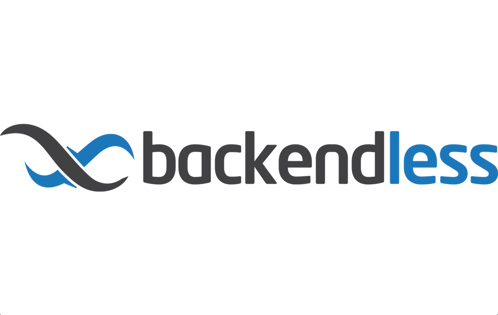

.                     |.                     
:--------------------:|:--------------------:
  |

# fetch_courses
Asynchronous batch processing for gatech course data in Typescript compiled ES11.

[](https://travis-ci.org/aubrey-y/fetch_courses)


## Setup

For local development, you will need to:

1. Install Node.js and run `npm install`

2. Provision [Backendless](https://backendless.com/) resources and acquire your application ID and JavaScript API key.

3. Create `.env` file for those credentials in the project base directory, like

   ```
   BACKENDLESS_APPLICATION_ID=
   BACKENDLESS_API_KEY=
   ```

4. Run `npm run dev` to start course collection process.
